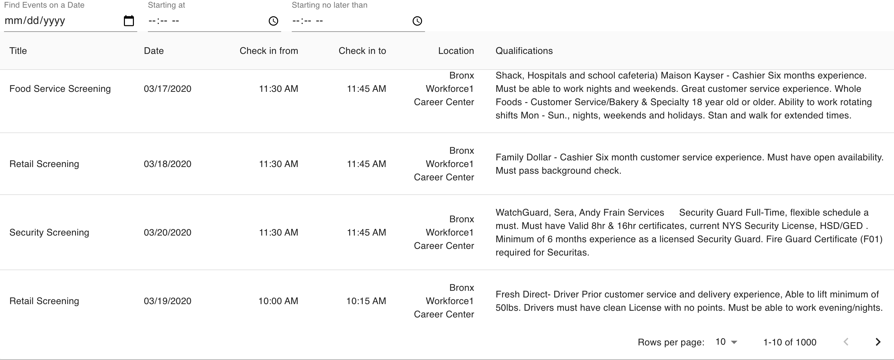

# Flask-React Events App

## Overview
Flask/React app that pulls data from the [SOCRATA API](https://dev.socrata.com/). Users can sort through data by date and time range.



## Running Locally

### App Token
Create a `config.py` file in the root directory with the same variables that appear in `config.py.example`. Get an app token from [SOCRATA](https://dev.socrata.com/docs/app-tokens.html) and add the value to the `app_token` variable in your `config.py` file.

### Setup a virtual environment
```
python3 -m venv venv
source venv/bin/activate
```

Install requirements:

```
pip install -r requirements.txt
```
Then run the server:

```
flask run
```

### Run the frontend
The `react-app` directory was bootstrapped with [Create React App](https://github.com/facebook/create-react-app).

```
cd react-app
npm start
```

## Approach

I used [Material UI](https://material-ui.com/) so that I could easily style a table to display the data. [Moment JS](https://momentjs.com/docs/) was used for formatting time.

For managing state, I used React hooks since this is a small application. I decided to use Flask for the backend since it's a lightweight framework that allowed me to quickly setup routing for the application.

Basic testing was setup with snapshots for the frontend and using `Pytest` for the backend.

## Next Steps

* Currently, the calendar/date range pickers are lagged when the state is updated. Resolve the lagging issue by moving logic to a `useEffect` statement.
* Pagination is currently being handled via the frontend. Move pagination logic to backend with offset and limit parameters.
* Add more extensive unit tests.